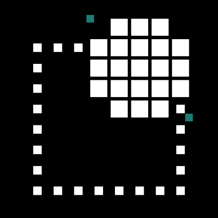

<div align="center">
   

   <h1>Logo Cut-Out</h1>

   <p>Cut the background out of any image at full quality — entirely in your browser, nothing ever uploaded.</p>

   <a href="https://github.com/IKadri-droid/Logo-cut-out/actions/workflows/build.yml"></a>

   <a href="#features">Features</a> &bull; <a href="#how-it-works">How it works</a> &bull; <a href="#installation">Installation</a> &bull; <a href="#tech-stack">Tech stack</a> &bull; <a href="#license">License</a>
</div>

---

## Features

- 🖼️ **Drag & drop, paste, or file picker, one image or a batch** — PNG, JPEG or WebP in, transparent PNG out. Copy an image from anywhere and Ctrl/Cmd+V it straight in.
- ⚡ **Fully client-side** — nothing is ever sent to a server, whichever engine below handles the cut.
- 🎯 **Precision engine for logos and product shots** — a deterministic chroma-key, no neural network, no blur.
- ✅ **Pick what you keep** — select any subset of a batch's results and download them together as a `.zip`.
- 📥 **Lossless export** — every result is a PNG at the original image's resolution.
- 🔍 **Zoom to check the edges** — enlarge the original or the cut-out result full size before deciding to keep it.
- 🌐 **Optional online AI mode** — for hard photographic cases, route the cut through a stronger model on Hugging Face instead of the bundled one, using your own free API token.

## How it works

Background removal here is a three-part problem: figuring out *which* pixels belong to the subject, keeping the pixels you already know are correct untouched, and — the part naive cutouts get wrong — not letting the background's color bleed into the edge pixels you keep.

That last part matters because most source images are already anti-aliased against their background: a logo's edge pixels aren't pure subject color, they're a blend with whatever was behind them. Slap an alpha mask on top of those pixels unchanged and you get a faint light/white halo around every edge — technically "the original pixels," but visibly degraded. Logo Cut-Out re-derives that edge ring instead of trusting it, with one of two engines depending on the image:

- **Flat/near-uniform background** (the common case for logos, product shots, icons — like the Microsoft logo or a product photo with a soft drop shadow): a border-connected flood fill (chroma key) finds the background with pixel precision, no model involved. It models the background as a *shaded* color rather than a fixed one — a drop shadow is the background color uniformly darkened, never a different hue — so a gradual studio shadow is removed in full instead of leaving a pale remnant, while a real subject edge (a genuine hue change, not just a brightness one) still stops it cold. That shading model breaks down for a near-black background, since hue is undefined at zero brightness — dark artwork would read as "background, darkened to zero" — so a plain, tight color match is used there instead. Every pixel more than a couple of pixels from the cut keeps its exact source color; the thin boundary ring is re-matted using that pixel's own color, decontaminated against the background rather than snapped to a neighbor's, which is what removes the halo without smudging fine detail (hair, thin strokes) next to it. Fast, deterministic, and available before any model even loads.
- **Already has transparency** (typically one of this app's own results, fed back in): returned as-is. Re-running chroma-key on it would read its cleared, transparent pixels as a brand new background and start eating into already-correct edges.
- **Anything else** (a real photographic background): an in-browser AI segmentation model (via [`@imgly/background-removal`](https://github.com/imgly/background-removal-js), on top of [ONNX Runtime Web](https://github.com/microsoft/onnxruntime), WASM/WebGPU) estimates a soft alpha mask directly. It's used as-is — a photographic mask can legitimately stay partially transparent far from any hard edge (hair, motion blur, a glow), so forcing it through the same hard re-matting as the flat-background path would corrupt exactly those pixels.

### Online AI mode (optional)

The offline model is a good general-purpose segmenter, but it isn't the strongest one available for hard cases (busy backgrounds, fine hair). Switching the topbar to **Online AI** routes non-flat cuts through a model of your choice on the [Hugging Face Inference API](https://huggingface.co/docs/api-inference) instead — [`briaai/RMBG-2.0`](https://huggingface.co/briaai/RMBG-2.0) by default, one of the strongest open background-removal models available. This needs a free Hugging Face account and API token, entered in **Settings** and kept only in this browser's `localStorage` — the app talks to Hugging Face directly, there is no server of ours in between. If the call fails for any reason (no token, rate limit, network), the image is silently reprocessed with the offline model instead and the card says so.

Flat backgrounds still always use the chroma-key engine regardless of this setting — no model beats an exact pixel match.

Note on licensing: RMBG-2.0's default weights are released for **non-commercial use**; check [its model card](https://huggingface.co/briaai/RMBG-2.0) before using online mode for anything commercial, or point Settings at a different model id.

Either way, the export is a PNG — a lossless format — so no compression artifacts sneak in at the finish line, and nothing ever leaves your machine: there is no upload step and no server component at all.

## Installation

Requires [Node.js](https://nodejs.org) 20+.

```bash
npm install
npm run dev      # http://localhost:5173
```

Production build:

```bash
npm run build     # outputs to dist/
npm run preview   # preview the build locally
```

To check the flat-background engine against a real file without opening a browser:

```bash
npm run verify:cutout -- path/to/image.png output.png
```

## Tech stack

- [React](https://github.com/facebook/react) + [Vite](https://github.com/vitejs/vite)
- [@imgly/background-removal](https://github.com/imgly/background-removal-js) — in-browser segmentation on top of ONNX Runtime Web
- [sharp](https://github.com/lovell/sharp) — rasterizes the SVG brand assets into the PNGs shipped in `public/` and `.github/assets/` (`npm run generate:assets`)
- [fflate](https://github.com/101arrowz/fflate) — bundles selected results into a `.zip` for download, client-side
- [Hugging Face Inference API](https://huggingface.co/docs/api-inference) — optional stronger model for the "Online AI" mode, called directly from the browser with your own token

## License

Published under the **MIT** license — see [`LICENSE`](LICENSE).
